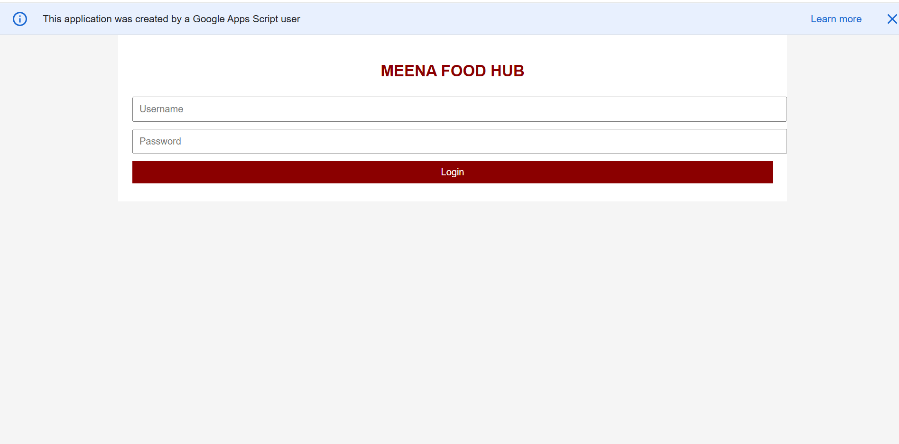
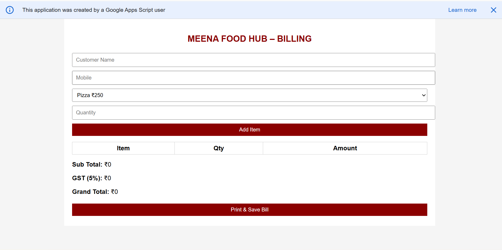
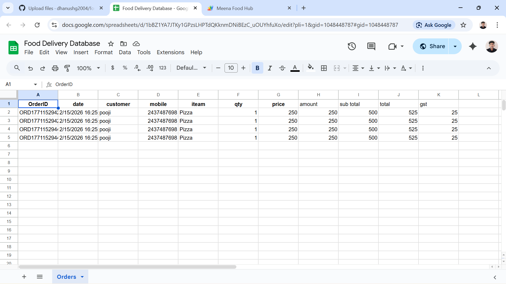

# food-delivery-management-system
Food Delivery Management System is a web-based application developed using Google Apps Script, Google Sheets, HTML, CSS, and JavaScript. The system helps manage food orders, customer details, delivery tracking, and admin operations through a simple web interface connected to Google Sheets as the database. 

## 📸 Screenshots

